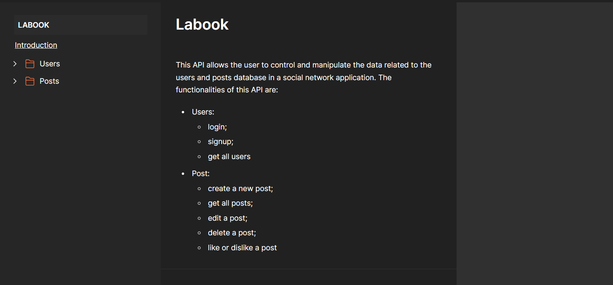

# API Labook



API to manage the database of a social network, that includes, the users and the posts.

For the users, the API allows you to signup as a new user, login as an existing one and get the information of all users if the account is an "ADMIN" type account.

For the posts, the API allows you to create, fetch, edit, delete, like and dislike the existing posts in the database.

[View the documentation](https://documenter.getpostman.com/view/26594436/2s9Y5YSiFi)

## Index
- <a href="#functionalities">Application functionalities</a>
- <a href="#demonstration">Demonstration</a>
- <a href="#run">How to run the application</a>
- <a href="#endpoints">Application endpoints</a>
- <a href="#tecnologies-used"> Tecnologies used</a>
- <a href="#developer">Developer</a>
- <a href="#next-steps">Next steps</a>

## Application functionalities
 - [x]  Signup  
 - [x]  Login
 - [x]  Get all users
 - [x]  Create post
 - [x]  Get all posts 
 - [x]  Edit post by id
 - [x]  Delete post by id
 - [x]  Like post by id
 - [x]  Dislike post by id
  
## Demonstration


## How to run
```bash
# Clone this repository
$ git clone repolink

# Acess the app folder on your terminal
$ cd labook-project

# Install the dependencies
$ npm install

# Run the app 
$ npm run dev

# Use your prefered API test tool to run the application
```

## Application endpoints

1. Endpoints for the users table:
 - Get all users: 
    - app.get => 'http://localhost:3003/users';
 - Signup
    - app.post => 'http://localhost:3003/users/signup';
 - Login
    - app.post => 'http://localhost:3003/users/login'.

2. Endpoints for the posts table:
 - Create post
    - app.post => 'http://localhost:3003/posts';
 - Get all posts
    - app.get => 'http://localhost:3003/posts';
 - Edit post by id
    - app.put =>'http://localhost:3003/posts/:id';
 - Delete post by id
    - app.delete => 'http://localhost:3003/posts/:id';
 - Like and dislike post by id
    - app.put => 'http://localhost:3003/posts/:id/like'.

## Tecnologies used
1. TypeScript
2. [Node.js](https://nodejs.org/en)
3. [Express](https://expressjs.com/pt-br/)
4. SQL
5. [SQLite](https://www.sqlite.org/index.html)
6. [Knex](https://knexjs.org/)
7. Object-Oriented Programming (OOP)
8. [UUID](https://www.uuidgenerator.net/)
9. [Zod](https://zod.dev/)
10. [Json Web Token](https://jwt.io/)
11. Layered Architecture

## Developer
[LinkedIn](https://www.linkedin.com/in/julia-silva-borges/)

## Next steps
 -[ ] Expand the database
 
 -[ ] Implement the API in a frontend application
